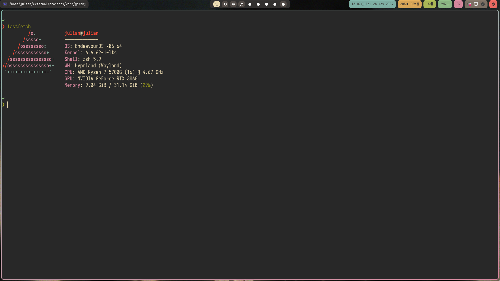
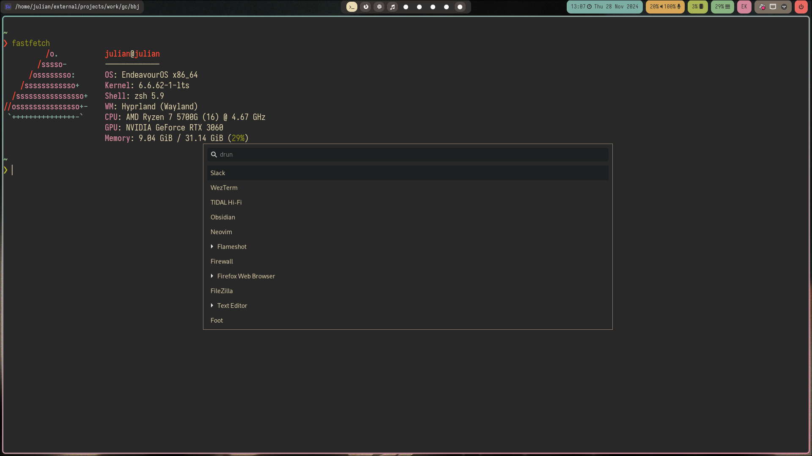
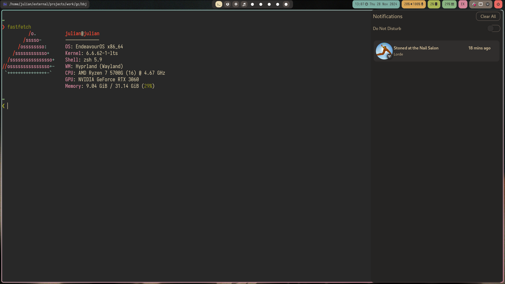
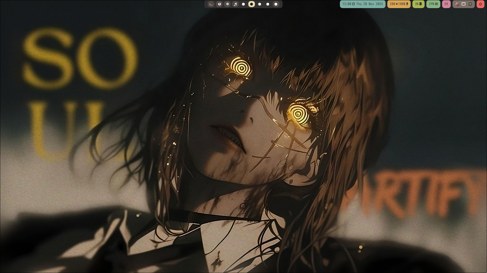
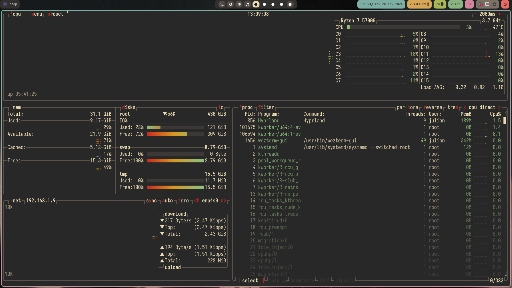
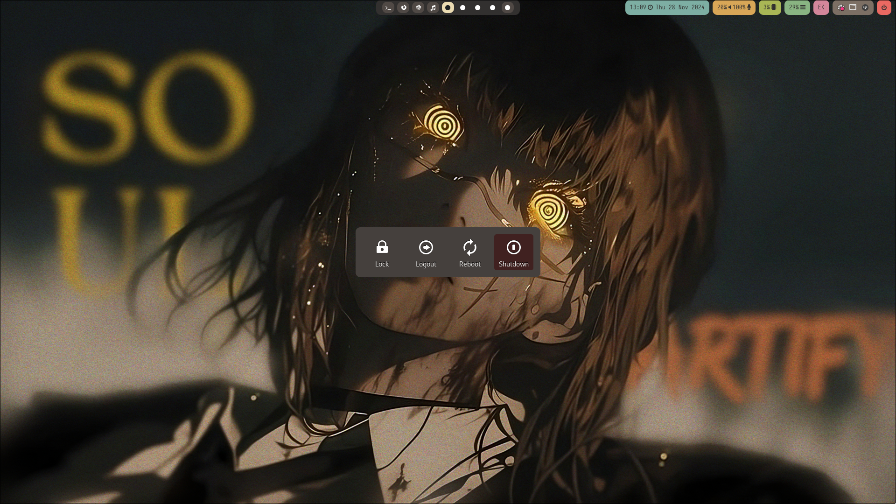

# Dots

Using:
- hyprland
- hyprpaper
- swaync
- ngw-bar
- hyprlock
- wofi

Relevant software:
- btop
- neovim
- swappy for screenshots annotation
- wezterm
- calcurse
- yazi
- eza
- fzf
- zsh

There's files for awesomewm as well (previous wm before hyprland)

## screenshots

